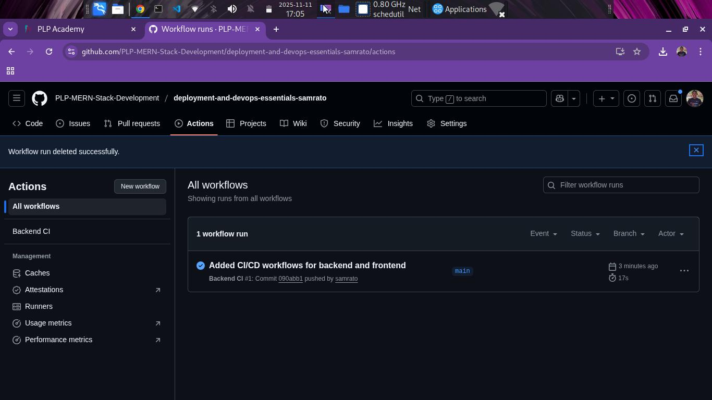

---

````markdown
# 📜 Katiba AI — Your Constitutional Chatbot for Kenya

**Katiba AI** (from the Swahili word *Katiba*, meaning *Constitution*) is a full-stack MERN web application that helps users understand and explore the **Constitution of Kenya (2010)** through an AI-powered chatbot.  
The project demonstrates **deployment and DevOps best practices** including CI/CD, environment management, and monitoring.

---

## 🚀 Week 7: Deployment and DevOps Essentials – Launching Your MERN App

### 🎯 Objective

To deploy the **Katiba AI** MERN stack application to production, implement CI/CD pipelines, configure secure environment variables, and set up monitoring for both frontend and backend services.

---

## 📂 Tasks & Implementation

### ✅ Task 1: Preparing the Application for Deployment

#### 🧩 Frontend (React)
- Built the optimized React production build using:
  ```bash
  npm run build
````

* Implemented **code splitting** using React’s dynamic import syntax.
* Configured environment variables via `.env`:

  ```
  VITE_API_URL=https://katiba-api.onrender.com
  ```

#### ⚙️ Backend (Express)

* Added centralized **error handling middleware**.
* Implemented **helmet** and **cors** for secure HTTP headers.
* Used **dotenv** for environment configuration:

  ```
  PORT=5000
  MONGO_URI=your_mongodb_atlas_uri
  AI_API_KEY=your_ai_api_key
  JWT_SECRET=your_secret
  ```
* Implemented **Winston logging** for production logs.

#### 🗄️ Database (MongoDB Atlas)

* Set up a **MongoDB Atlas cluster**.
* Created dedicated database users with limited privileges.
* Configured **connection pooling** for performance and reliability.

---

### ✅ Task 2: Deploying the Backend

* Deployed the backend to **Render** cloud platform.
* Configured **environment variables** via the Render dashboard.
* Enabled **continuous deployment** linked to the GitHub repo.
* Added **HTTPS** with automatic SSL/TLS.
* Enabled **monitoring & logging** using Render’s built-in dashboard.

🔗 **Backend API URL:** [https://katiba-api.onrender.com](https://katiba-api.onrender.com)

---

### ✅ Task 3: Deploying the Frontend

* Deployed the React frontend to **Vercel**.
* Configured build settings with:

  ```
  npm run build
  ```
* Added **environment variables** in Vercel settings.
* Enabled **automatic deployment from GitHub main branch**.
* HTTPS is enabled by default with **Vercel’s SSL certificate**.
* Configured **caching for static assets**.

🔗 **Frontend Live URL:** [https://katiba-ai.vercel.app/](https://katiba-ai.vercel.app/)

---

### ✅ Task 4: CI/CD Pipeline Setup

* Configured **GitHub Actions** workflow:

  * Runs **linting** and **build tests** on push and pull requests.
  * Automatically deploys to **Vercel** (frontend) and **Render** (backend) upon successful builds.
  * Includes rollback strategy by reverting to last successful deployment.

Example workflow (`.github/workflows/deploy.yml`):

```yaml
name: Deploy Katiba AI
on:
  push:
    branches:
      - main
jobs:
  build:
    runs-on: ubuntu-latest
    steps:
      - uses: actions/checkout@v3
      - run: npm install
      - run: npm run build
```

🖼️ **Pipeline Screenshot:**
See screenshots section below for visual examples of successful workflow runs.

---

### ✅ Task 5: Monitoring and Maintenance

* **Health Check Endpoint:** `/api/health` returns `200 OK` if backend is active.
* **Uptime Monitoring:** Configured using [UptimeRobot](https://uptimerobot.com/).
* **Error Tracking:** Implemented using Sentry (optional).
* **Performance Monitoring:**

  * Server metrics tracked via Render Dashboard.
  * Frontend load times monitored using Vercel Analytics.

#### 🛠 Maintenance Plan

* Schedule monthly **dependency updates**.
* Weekly **database backups** via MongoDB Atlas.
* Maintain **rollback documentation** and deployment logs.

---

## 🧪 Expected Outcome

By completing this deployment:

* Katiba AI is now **accessible publicly** via Vercel (frontend) and Render (backend).
* CI/CD pipelines automate testing and deployment.
* Environment variables are securely managed.
* Monitoring and maintenance plans ensure app reliability.

---

## 🧾 Documentation

* **Frontend:** React + Tailwind + React Markdown
* **Backend:** Node.js + Express + MongoDB
* **Deployment:** Render (API) + Vercel (Frontend)
* **CI/CD:** GitHub Actions
* **Monitoring:** UptimeRobot + Render Logs

---

## 📸 Screenshots

| Feature / Description            | Screenshot                                                   |
| -------------------------------- | ------------------------------------------------------------ |
| 💬 Chatbot UI (Frontend Preview) |                      |
| ⚙️ CI/CD Workflow Overview       |                   |
| 🚀 Deployment Success Log        |  |

> The above screenshots demonstrate the chatbot interface, workflow automation in GitHub Actions, and successful backend deployment.

---

## 🧩 Environment Variable Templates

`.env.example`

```
PORT=5000
MONGO_URI=
AI_API_KEY=
JWT_SECRET=
```

`.env.local.example`

```
VITE_API_URL=https://katiba-api.onrender.com
```

---

## ✅ Submission Details

* **Frontend URL:** [https://katiba-ai.vercel.app/](https://katiba-ai.vercel.app/)
* **Backend URL:** [https://katiba-api.onrender.com](https://katiba-api.onrender.com)
* **CI/CD Pipeline Screenshot:**
  
  
* **Monitoring Setup Screenshot:** *(Add UptimeRobot or Render dashboard screenshot if available)*

---

## 🧑‍💻 Developer

**Willington Juma**
📧 [willingtonjuma@gmail.com](mailto:willingtonjuma@gmail.com)
🌍 [Live App](https://katiba-ai.vercel.app/)
💼 [GitHub Profile](https://github.com/yourusername)

---

> *“Empowering citizens through accessible constitutional knowledge.”* 🇰🇪

```

---

